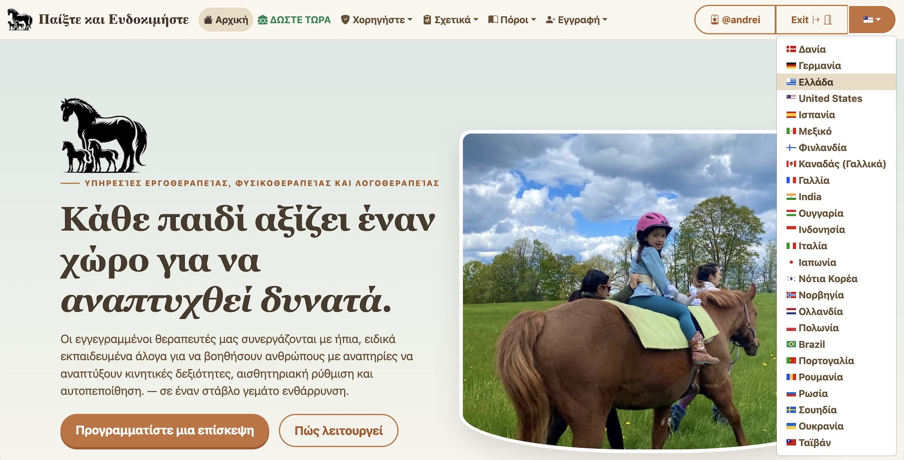
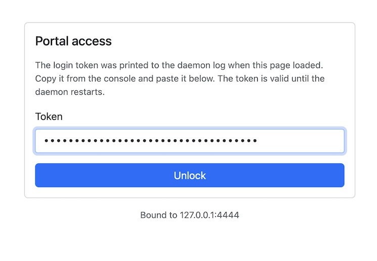
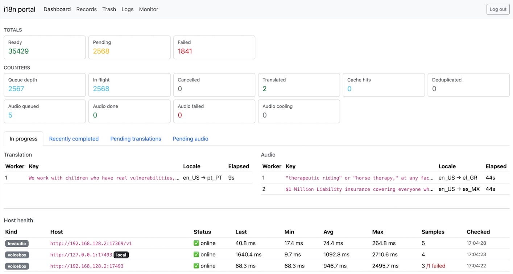
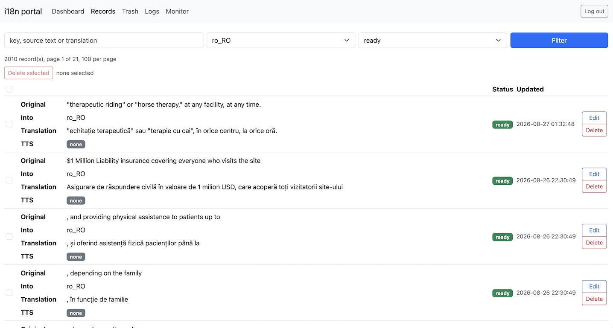
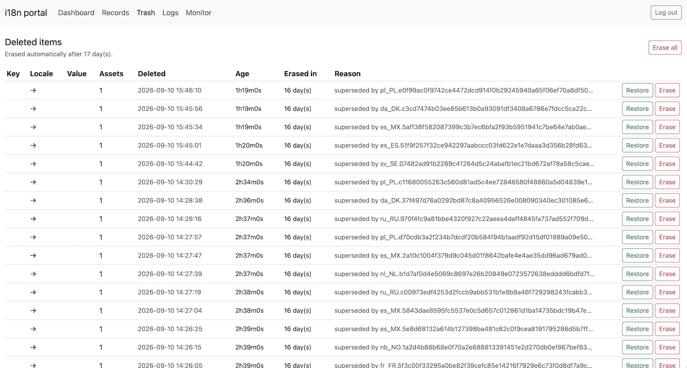
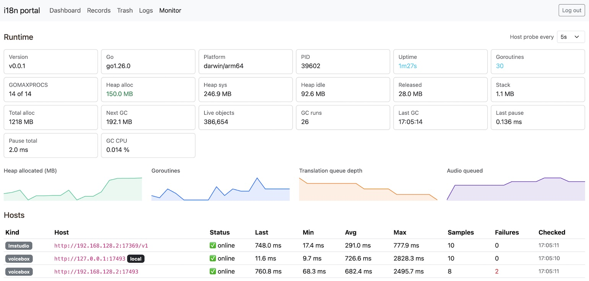
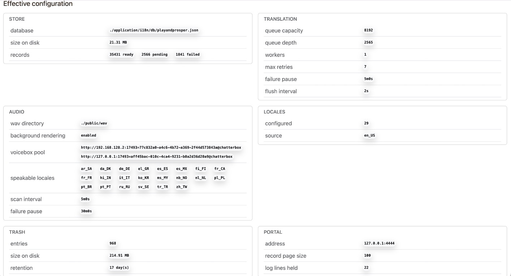
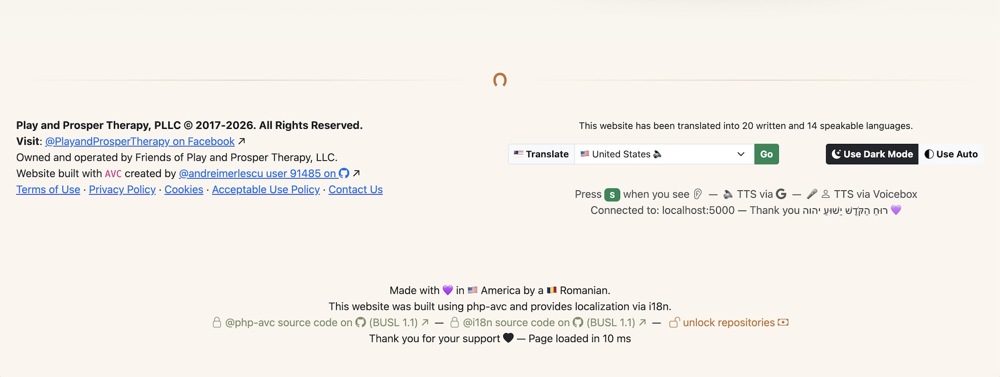

# About Play and Prosper's Sponsor i18n Offering

The **i18n** product is being built to support philanthropic efforts of [Play and Prosper](https://playandprospertherapy.com/). This product was built to provide information resources to patients around the world in a localized and accessible manner. 

- 📦 Repository 👉🏻 https://github.com/playandprosper/i18n 🔒
- 🔓 Unlock 👉🏻 https://github.com/sponsors/andreimerlescu 🤩

**i18n** is a universal application written in _Go_ that provides an internationalization and localization daemon that a web application can consume to provide translations in dozens of languages using AI. The application does not run AI for every request. It caches translated keys and provides hot cache access to those keys. It has the ability to render text and audio translations.



The **i18n** application is used in conjunction with the [php-avc](https://github.com/playandprosper/sponsor-avc) Model View Controller framework. It is compatible with **Ruby on Rails** and other `i18n` components. In fact, [php-avc](https://github.com/playandprosper/sponsor-avc) has a customized `i18n.php` helper script that interfaces with the engine itself, to provide an easier templating experience to the PHP framework. In Ruby, the [i18n-rubygem](https://github.com/playandprosper/i18n-rubygem) package is designed to provide that `i18n.php` interface into the **i18n** binary to the Rails framework. You can bring the **i18n** binary to any front end system. It's a basic HTTP GET request to `127.0.0.1:8888/en_US?key=&text=&context=` in order to get back the translated value. You can also hit `127.0.0.1:8888/meta?key=<key>` to extract data points like `language`, `country`, `currency`, `flag`, `bcp`, `capitol`, `tz`, `short`. Replace `<key>` with any one of them and the body of the request contains the value of the metadata property itself. The `flag` returns with a literal emoji like `🇺🇸`.

By sponsoring the repository, you're not buying a copy of the source code for ownership. You're being granted a limited use license under BUSL 1.1 until it becomes open source on 11/11/2033. Without sponsorship, permission to run and use the binary is prohibited. To begin using **i18n** in _any capacity_ please select the $666/mo option here 👉🏻 https://github.com/sponsors/andreimerlescu. Sponsorship grants you read-only access to the _source code_ of i18n and it unlocks the binary download links below.

Now, let me show you what you're sponsoring! When you see it live on the [Play and Prosper](https://playandprospertherapy.com/) website, it'll sell itself, but until that day arrives, this page will have to do until then. 

## Installation

Once you've unlocked the repository, these links will work. If you're not signed into GitHub or you haven't sponsored the developer yet, you'll see a 404 Not Found error on each of these links.

| Target | Size | Checksum | &nbsp; |
|---|---|---|---|
| Linux `amd64` | 9.13MB | `00a2554246c8ecd59e61e59691b03c3d05d3e3fc30b72f33ef85fd779c3dfe6a` | [↯](https://github.com/playandprosper/i18n/releases/download/v0.0.1/i18n-linux-amd64) |
| Linux `arm64` | 9.72MB | `13c08b36a00a89e4e3b61ebd1c7288ed3ce1630d48ec079d8bfa7ed06d671771` | [↯](https://github.com/playandprosper/i18n/releases/download/v0.0.1/i18n-linux-arm64) |
| macOS `Silicon` | 9.3MB | `3b81290e3adbfcb28032ca3fecb7ef3512ddd79daa4a38142b6d37d1dfd0e3be` | [↯](https://github.com/playandprosper/i18n/releases/download/v0.0.1/i18n-darwin-arm64) |
| macOS `Intel` | 9.93MB | `273f9e2aad88f3145339c5f09d976ae736cee08cd31c3abaa429ca0e37604259` | [↯](https://github.com/playandprosper/i18n/releases/download/v0.0.1/i18n-darwin-amd64) |
| Windows `amd64` | 10MB | `375ffd654185e3b68e7ee52918e8f37fe6af01f8929fd7a130d2c09c3cd67805` | [↯](https://github.com/playandprosper/i18n/releases/download/v0.0.1/i18n-amd64.exe) |
| Windows `arm64` | 9.18MB | `22cf4576657b4fa82e681ed9c6441c7a5cb409148a519e82d34f08680e5126c8` | [↯](https://github.com/playandprosper/i18n/releases/download/v0.0.1/i18n-arm64.exe) |

### Manual Installation

```bash
mkdir -p ~/work/i18n
git clone git@github.com:playandprosper/i18n.git ~/work/i18n
cd ~/work/i18n
```
#### macOS & Linux Targets

```bash
./install.sh # macos and linux targets only
```

#### Windows Targets

```cmd
./install.ps1
# or
powershell -ExecutionPolicy Bypass -File .\install.ps1
```


## Running `i18n`



The **Play and Prosper** website uses this helper script to boot `voicebox-server` and `i18n`. It requires **LMStudio** to be opened manually before launching. However, once running, this script makes some assumptions. Change the variables to your values before running.

Here is the Bash script: 

```bash
#!/usr/bin/env bash
set -uo pipefail

 : "${VOICEBOX_PORT=17493}"
 : "${LMSTUDIO_PORT=17369}"

 : "${STUDIO_IP="192.168.128.2"}"
 : "${LAPTOP_IP="127.0.0.1"}"

 : "${STUDIO_LMSTUDIO_MODEL="qwen3.6-35b-a3b"}"
# : "${STUDIO_VOICEBOX_PROFILE="77c832a0-a4c6-4b72-a369-2f44d573843a"}" # Andrei
 : "${STUDIO_VOICEBOX_PROFILE="aff45bac-010c-4ca4-9231-b0a2d36d20a9"}" # Heather

 : "${LAPTOP_LMSTUDIO_MODEL="qwen3.8-27b"}"
# : "${LAPTOP_VOICEBOX_PROFILE="e28f8dcf-7397-44e7-994a-1b03fc35f203"}" # Andrei
 : "${LAPTOP_VOICEBOX_PROFILE="aff45bac-010c-4ca4-9231-b0a2d36d20a9"}" # Heather

 : "${DB_DIR="./application/i18n/db"}"
 : "${WAV_DIR="./public/wav"}"
 : "${MP3_DIR="./public/mp3"}"

 : "${REMOTE_LOG_DIR="/Users/andrei/Desktop"}"
 : "${REMOTE_SERVER_DIR="/Applications/Voicebox.app/Contents/MacOS"}"
 : "${REMOTE_DATA_DIR="/Users/andrei/Library/Application Support/sh.voicebox.app"}"

 : "${LOG_DIR="./logs"}"
 : "${LOCAL_SERVER_DIR="/Applications/Voicebox.app/Contents/MacOS"}" 
 : "${LOCAL_DATA_DIR="/Users/andrei/Library/Application Support/sh.voicebox.app"}"

 : "${DB="${DB_DIR}/playandprosper.json"}"

 : "${STUDIO_LMSTUDIO_URL="http://${STUDIO_IP}:${LMSTUDIO_PORT}/v1"}"
 : "${STUDIO_VOICEBOX_URL="http://${STUDIO_IP}:${VOICEBOX_PORT}"}"

 : "${LAPTOP_LMSTUDIO_URL="http://${LAPTOP_IP}:${LMSTUDIO_PORT}/v1"}"
 : "${LAPTOP_VOICEBOX_URL="http://${LAPTOP_IP}:${VOICEBOX_PORT}"}"

 : "${VB_SVR_1="${STUDIO_VOICEBOX_URL}=${STUDIO_VOICEBOX_PROFILE}"}"
 : "${VB_SVR_2="${LAPTOP_VOICEBOX_URL}=${LAPTOP_VOICEBOX_PROFILE}"}"
 : "${LM_SVR_1="${STUDIO_LMSTUDIO_URL}=${STUDIO_LMSTUDIO_MODEL}"}"
 : "${LM_SVR_2="${LAPTOP_LMSTUDIO_URL}=${LAPTOP_LMSTUDIO_MODEL}"}"

 : "${VOICEBOX_ENGINE="chatterbox"}"

 : "${PORTAL_PASS="generate"}"

if [[ "${PORTAL_PASS}" == "generate" ]]; then
  PORTAL_PASS=$(genwordpass)
  echo "-----------------------------------------------------------------------"
  echo "🚨🚨🚨                                                          🚨🚨🚨"
  echo "🚨🚨🚨 YOUR TEMPORARY PORTAL_PASS ${PORTAL_PASS}                🚨🚨🚨"
  echo "🚨🚨🚨 We've placed the temporary password into your clipboard. 🚨🚨🚨"
  echo "🚨🚨🚨                                                          🚨🚨🚨"
  echo "========================================================================"
  echo $PORTAL_PASS | pbcopy
fi

check(){
  if [[ ! -d "${LOG_DIR}" ]]; then
    mkdir -p "${LOG_DIR}"
  fi
}

run_voicebox(){
  mkdir -p "${LOG_DIR}"

  if lsof -i :"${VOICEBOX_PORT}" -sTCP:LISTEN -t >/dev/null 2>&1; then
    echo "✅ voicebox already listening on 127.0.0.1:${VOICEBOX_PORT}"
    return 0
  fi

  echo "🚀 starting voicebox on 127.0.0.1:${VOICEBOX_PORT}"

  "${LOCAL_SERVER_DIR}/voicebox-server" \
    --data-dir "${LOCAL_DATA_DIR}" \
    --port "${VOICEBOX_PORT}" \
    --host 127.0.0.1 \
    >"${LOG_DIR}/voicebox.log" 2>&1 &

  local deadline=$((SECONDS + 120))
  while ((SECONDS < deadline)); do
    if curl -fsS --max-time 2 "http://127.0.0.1:${VOICEBOX_PORT}/health" >/dev/null 2>&1; then
      echo "✅ voicebox healthy on 127.0.0.1:${VOICEBOX_PORT}"
      return 0
    fi
    sleep 1
  done

  echo "❌ 🚨 voicebox did not become healthy within 120s; see ${LOG_DIR}/voicebox.log" >&2
  return 1
}

remote_voicebox() {
  echo "🚀 starting voicebox on ${STUDIO_IP}:${VOICEBOX_PORT}"

  ssh -i ~/.ssh/laptop_to_studio_id_ed25519_c33p andrei@studio.local "
    echo \"Connecting to port: ${VOICEBOX_PORT}\n\"
    if ! lsof -i :${VOICEBOX_PORT} -sTCP:LISTEN -t >/dev/null 2>&1; then
      nohup \"${REMOTE_SERVER_DIR}/voicebox-server\" \
        --data-dir \"${REMOTE_DATA_DIR}\" \
        --port ${VOICEBOX_PORT} \
        --host 0.0.0.0 > \"${REMOTE_LOG_DIR}/voicebox.log\" 2>&1 &
      stat \"\$HOME/Desktop/voicebox.log\"
      disown
    fi
  "

  local deadline=$((SECONDS + 120))
  while ((SECONDS < deadline)); do
    if curl -fsS --max-time 2 "${STUDIO_VOICEBOX_URL}/health" >/dev/null 2>&1; then
      echo "✅ voicebox healthy on ${STUDIO_IP}:${VOICEBOX_PORT}"
      return 0
    fi
    sleep 1
  done

  echo "❌ 🚨 remote voicebox did not become healthy within 120s" >&2
  return 1
}

# localhost
localhost(){
  run_voicebox
  echo $PORTAL_PASS | pbcopy
  i18n \
    -db "${DB}" \
    -log-dir "${LOG_DIR}" \
    -lm-url "${LAPTOP_LMSTUDIO_URL}" \
    -lm-model "${LAPTOP_LMSTUDIO_MODEL}" \
    -portal \
    -portal-port 4444 \
    -portal-prune-every 17 \
    -portal-token "${PORTAL_PASS}" \
    -request-timeout 3m33s \
    -retries 3 \
    -shutdown-wait 33s \
    -wav-dir "${WAV_DIR}" \
    -voicebox-url "${LAPTOP_VOICEBOX_URL}" \
    -voicebox-profile "${LAPTOP_VOICEBOX_PROFILE}" \
    -voicebox-engine "${VOICEBOX_ENGINE}" \
    -audio-background \
    -transcode \
    -mp3-dir "${MP3_DIR}"
}

remote(){
  remote_voicebox
  run_voicebox
  echo $PORTAL_PASS | pbcopy
  VOICEBOX_SERVERS="${VB_SVR_1},${VB_SVR_2}" \
  i18n \
    -db "${DB}" \
    -log-dir "${LOG_DIR}" \
    -lm-url "${STUDIO_LMSTUDIO_URL}" \
    -lm-model "${STUDIO_LMSTUDIO_MODEL}" \
    -portal \
    -portal-port 4444 \
    -portal-prune-every 17 \
    -portal-token "${PORTAL_PASS}" \
    -request-timeout 3m33s \
    -retries 3 \
    -shutdown-wait 33s \
    -voicebox-profile "${STUDIO_VOICEBOX_PROFILE}" \
    -voicebox-engine "${VOICEBOX_ENGINE}" \
    -transcode \
    -audio-background \
    -wav-dir "${WAV_DIR}" \
    -mp3-dir "${MP3_DIR}"
}

multi(){
  remote_voicebox
  run_voicebox
  echo $PORTAL_PASS | pbcopy
  # Multi Host
  VOICEBOX_SERVERS="${VB_SVR_1},${VB_SVR_2}" \
  LMSTUDIO_SERVERS="${LM_SVR_1},${LM_SVR_2}" \
  i18n \
    -db "${DB}" \
    -log-dir "${LOG_DIR}" \
    -portal \
    -portal-port 4444 \
    -portal-prune-every 17 \
    -portal-token "${PORTAL_PASS}" \
    -request-timeout 3m33s \
    -retries 3 \
    -shutdown-wait 33s \
    -wav-dir "${WAV_DIR}" \
    -voicebox-engine "${VOICEBOX_ENGINE}" \
    -audio-background \
    -transcode \
    -mp3-dir "${MP3_DIR}"
}

check

remote_tail() {
  local path="${1}"
  local cmd="tail -f -n +1 ${path}"
  ssh andrei@studio.local "${cmd}"
}

if [ "${1:-}" == "voicebox" ]; then
  run_voicebox
  exit
fi

if [ "${1:-}" == "remote-voicebox" ]; then
  remote_voicebox
  remote_tail "${REMOTE_LOG_DIR}/voicebox.log"
  exit
fi

if [ "${1:-}" == "multi-voicebox" ]; then
  remote_voicebox
  remote_tail "${REMOTE_LOG_DIR}/voicebox.log" &
  run_voicebox
  exit
fi

if ! command -v genwordpass; then
  go install github.com/andreimerlescu/genwordpass@latest
fi

if ! command -v ffmpeg >/dev/null 2>&1; then
  echo "❌ 🚨 ffmpeg is required for -transcode; install it with: brew install ffmpeg" >&2
  exit 1
fi

if ! ffmpeg -hide_banner -encoders 2>/dev/null | grep -q libmp3lame; then
  echo "❌ 🚨 ffmpeg has no libmp3lame encoder; reinstall with: brew reinstall ffmpeg" >&2
  exit 1
fi

echo "✅ ffmpeg with libmp3lame available"


if [ "${1:-}" == "local" ]; then
  localhost
  exit
fi

if [ "${1:-}" == "remote" ]; then
  remote
  exit
fi

if [ "${1:-}" == "multi" ] || [ "${1:-}" == "both" ]; then
  multi
  exit
fi

while true; do
  echo "How do you want to run this?"
  echo "  1| local "
  echo "  2| remote "
  echo "  3| multi "
  echo
  read -p "Choose one (1|2|3)?: " yn
  case $yn in
    [1Ll]* ) localhost; break;;
    [2Rr]* ) remote; break;;
    [3Mm]* ) multi; exit 0;;
    *     ) echo "Invalid input. Please enter '1', '2' or '3'. "; continue;;
  esac
done
```


## i18n Management

The application is designed to set it and forget it, but if you want to get into the day to day of managing it, you can access the Portal at [localhost:4444](http://127.0.0.1:4444). 

### Dashboard

The middle tabs live update.



### Records Management

With tens of thousands of records in the global system, each specific language will typically contain several thousand keys each. From this interface, you can directly access and play the sound file using an HTML5 element.



### Trash

The trash deletes itself based on the flag, and in the interface, you can empty the trash immediately.



### Monitor

Refresh cadence can be as often as every 5s to display the graphs and live data about the runtime of the application.





You can also connect to Victoria Metrics or Prometheus to [http://localhost:8888/metrics](http://localhost:8888/metrics) and observe the following data points in your Grafana dashboard.

```txt
# HELP i18n_queue_depth Current translation queue size
# TYPE i18n_queue_depth gauge
i18n_queue_depth 2549
# HELP i18n_pending_in_memory Deduplicated translations currently in flight
# TYPE i18n_pending_in_memory gauge
i18n_pending_in_memory 2550
# HELP i18n_store_dirty Whether unsaved store changes are awaiting the next debounced flush
# TYPE i18n_store_dirty gauge
i18n_store_dirty 0
# HELP i18n_store_ready Cached ready translations
# TYPE i18n_store_ready gauge
i18n_store_ready 35447
# HELP i18n_store_pending Persisted pending translations
# TYPE i18n_store_pending gauge
i18n_store_pending 2550
# HELP i18n_store_failed Persisted failed translations
# TYPE i18n_store_failed gauge
i18n_store_failed 1841
# HELP i18n_requests_total Translation requests
# TYPE i18n_requests_total counter
i18n_requests_total 0
# HELP i18n_cache_hits_total Translation cache hits
# TYPE i18n_cache_hits_total counter
i18n_cache_hits_total 0
# HELP i18n_jobs_queued_total Translation jobs queued
# TYPE i18n_jobs_queued_total counter
i18n_jobs_queued_total 2570
# HELP i18n_translations_total Successful translations
# TYPE i18n_translations_total counter
i18n_translations_total 20
# HELP i18n_failures_total Permanently failed translations
# TYPE i18n_failures_total counter
i18n_failures_total 0
# HELP i18n_deduplicated_total Duplicate pending jobs suppressed
# TYPE i18n_deduplicated_total counter
i18n_deduplicated_total 0
# HELP i18n_cancelled_total Queued translations withdrawn before dispatch
# TYPE i18n_cancelled_total counter
i18n_cancelled_total 0
# HELP i18n_audio_pending Audio assets queued or rendering
# TYPE i18n_audio_pending gauge
i18n_audio_pending 3
# HELP i18n_audio_cooling Assets in post-failure cooldown
# TYPE i18n_audio_cooling gauge
i18n_audio_cooling 0
# HELP i18n_audio_queued_total Audio jobs queued
# TYPE i18n_audio_queued_total counter
i18n_audio_queued_total 39
# HELP i18n_audio_generated_total WAV assets rendered
# TYPE i18n_audio_generated_total counter
i18n_audio_generated_total 37
# HELP i18n_audio_failed_total Audio renders that failed
# TYPE i18n_audio_failed_total counter
i18n_audio_failed_total 0
# HELP i18n_audio_unsupported_total Assets skipped for unsupported language
# TYPE i18n_audio_unsupported_total counter
i18n_audio_unsupported_total 0
# HELP i18n_audio_cancelled_total Queued audio withdrawn before rendering
# TYPE i18n_audio_cancelled_total counter
i18n_audio_cancelled_total 0
# HELP i18n_audio_scans_total Completed backlog scans
# TYPE i18n_audio_scans_total counter
i18n_audio_scans_total 0
```


## Air Gap Projects

Yes, **i18n** can run entirely offline while disconnected from the internet. Depending on your settings, the AI, TTS and transcoding can utilize your system resources extensively. If running on battery, you'll deplete quickly. If you're on a low powered source, like a train or bus, you'll be plugged in but your battery will keep going down faster than energy is going in. It's written in Go and designed to use the full resources available to it as if it was running on a server. Given this information, yes, you can run **i18n** while in Airplane mode and you'll generate _new translations_ for your content.

What this really means is that if you're operating in a space that you **require air gap security** then this product is literally built _for you._ The developer of this project was recruited into Cisco Systems' in Enhanced Customer Aligned Testing Services (eCATS) that got transformed into Solution Validation Services (SVS). Much of the software there and then needed to run in air-gapped networks. That work happened 17 years ago! A decade ago they were at Oracle releasing OCI into the world to compete with Amazon's AWS. Air gapped security was mandatory. 

This means organizations like _Defense, Gaming, Finance and Education_ can utilize #i18n to provide a **rich user experience** designed to demystify globalization, speech language pathology, and advance the causes of Dr Ajzenman's Play and Prosper Therapy through sponsoring this project. A simple sponsorship gets you a seat at the table during the development of this product that will be used to globally transform treatment approaches for disabled children worldwide.


## Configuration

When reading the following table, note that I am using _shorthand notation_ for the following types.

```go
type dur time.Duration
type sec time.Second
type min time.Minute
type str string
```

The **i18n** binary is split into 4 components: 

1. HTTP2 Daemon `:8888` 👉🏻 Frontend Frameworks ( like [php-avc](https://github.com/playandprosper/sponsor-avc) )
2. HTTP Portal `:4444` 👉🏻 Runtime GUI + Monitor
3. `-compile-audio` mode performs TTS using [voicebox](https://github.com/jamiepine/voicebox)-server generating `.wav` files
4. `-transcode` mode compresses `.wav` files into `.mp3` files

The entire runtime of the binary is controlled by the following flags. You read the first cell literally as `<flag>` a `<type>` is `<default>` where I am using _shorthand_ notation for `time.Duration`, `time.Second`, `time.Minute`, and `string` Go types.

| Flag | Usage |
|---|---|
| `-v` a `bool` is `false` | Show version |
| `-locales` a `bool` is `false` | Print every locale supported |
| `-db` a `str` is `i18n-db.json` | Database path for json file |
| `-to` a `str` is `<empty>` | Target locale |
| `-from` a `str` is `en_US` | Source locale |
| `-key` a `str` is `<empty>` | Translation to process |
| `-text` a `str` is `<empty>` | **CLI Mode:** Translation to process |
| `-addr` a `str` is `127.0.0.1:8888` | HTTP Daemon Process Port |
| `-force` a `bool` is `false` | Ignore cache |
| `-lm-server` a `[]str` is `<empty>` | CSV of `URL=MODEL` LM Studio Hosts |
| `-lm-url` a `str` is `http://127.0.0.1:1234/v1` | **Single:** LMStudio API URL  |
| `-lm-model` a `str` is `<empty>` | **Single:** LMStudio Model Name |
| `-lm-token` a `str` is `<empty>` | AI API Token (ignore for LMStudio) |
| `-context` a `str` is `<empty>`  | **CLI Mode:** Translation context |
| `-retries` a `int` is `1` | **CLI Mode:** Retry count before giving up |
| `-queue-size` a `int` is `8192` |  Maximum queued translations |
| `-max-retries` a `int` is `7` | Maxmimum retry attempts |
| `-shutdown-wait` a `dur` is `15 * sec` | Shutdown drain time limit |
| `-failure-pause` a `dur` is `5 * min` | Cooldown between retries |
| `-flush-interval` a `dur` is `2 * min` | DB Persistence Cadence |
| `-request-timeout` a `dur` is `90 * sec` | LMStudio Request Timeout |
| `-log` a `string` is `<empty>` | Alias for `-log-path` and `-log-dir` |
| `-log-path` a `str` is `<empty>` | File path to append new log messages |
| `-log-dir` a `str` is `<empty>` | Directory for `i18n-#.log` rotated logs |
| `-log-lines` a `int` is `3000` | Number of log lines to keep in memory |
| `-compile-audio` a `bool` is `false`  | Compile Voicebox TTS |
| `-wav-dir` a `str` is `i18n_wav` | Directory for .wav audio |
| `-mp3-dir` a `str` is `i18n_mp3` | Directory for .mp3 audio |
| `-voicebox-url` a `str` is `http://127.0.0.1:17493`  | `voicebox-server` bind address |
| `-voicebox-profile` a `str` is `<empty>`  | Voice ID to use |
| `-voicebox-engine` a `str` is `<empty>`  | Voicebox Engine to use |
| `-voicebox-token` a `str` is `<empty>`  | Voicebox API Bearer Token |
| `-audio-timeout` a `dur` is `5 * min`  | Max allowed process time per entry |
| `-audio-retries` a `int` is `3`  | Max retires for failed audio |
| `-audio-force` a `bool` is `false`  | Ignore cached audio files and regenerate |
| `-audio-strict` a `bool` is `false`  | Abort entire compile on single key failure |
| `-audio-require-language` a `bool` is `false`  | Fail for missing languages |
| `-audio-plan` a `bool` is `false`  | Print and exit audio locales for usage |
| `-voicebox-capabilities` a `bool` is `false`  | Dump voicebox capabilities and exit |
| `-audio-workers` a `int` is `1`  | Number of voicebox hosts to use |
| `-audio-background` a `bool` is `false`  | Render `.wav` in background |
| `-voicebox-server` a `[]str` is `<empty>`  | CSV of URL=PROFILE |
| `-portal` a `bool` is `true`  | Enable the HTTP Portal |
| `-portal-port` a `int` is `4444`  | Portal Launched on Port |
| `-portal-token` a `str` is `<empty>`  | Specify the password to the portal |
| `-portal-page-size` a `int` is `100`  | Items per page in Portal |
| `-portal-prune-every` a `int` is `144`  | Empty trash every #-days |
| `-transcode` a `bool` is `fase`  | Convert `.wav` to `.mp3` |
| `-ffmpeg` a `str` is `ffmpeg`  | Path to `ffmpeg` binary |
| `-mp3-bitrate` a `str` is `48k`  | Bitrate for `.mp3` files |
| `-transcode-workers` a `int` is `1`  | Concurrent ffmpeg processes |
| `-transcode-scan-interval` a `dur` is `5 * min`  | `.wav` to `.mp3` interval cooldown |
| `-transcode-failure-pause` a `dur` is `30 * min`  | Cooldown between retries |
| `-transcode-keep-wav` a `bool` is `false`  | Leave `.wav` after `.mp3` verified |

When using _dur_ or `time.Duration`, it's captured as an `int` and requires you to use `time.Duration` values.

| Human Time | `time.Duration` Value | Go Syntax |
|---|---|---|
| `15s` | `15000000000` | `15 * time.Second` |
| `90s` | `90000000000` | `90 * time.Second` |
| `2m` | `120000000000` | `2 * time.Minute` |
| `5m` | `300000000000` | `5 * time.Minute` |
| `30m` | `1800000000000` | `30 * time.Minute` |

For a more detailed look into `time.Duration` to `int` conversions for `flag.Duration` usage in Go, please see [this gist](https://gist.github.com/andreimerlescu/2c15535e22b5d0b3ba8141a1ecb8b98b).

## PHP Usage

The `i18n.php` file has the following header signature:

```php
<?php declare(strict_types=1);
namespace AVC;

require_once __DIR__ . '/router.php';
require_once __DIR__ . '/html.php';

final class i18n
{

    public static string $locale = LOCALE_UNITED_STATES['code'];
    public static string $sourceLocale = LOCALE_UNITED_STATES['code'];
    public static string $service = 'http://127.0.0.1:8888';
    public static int $connectTimeoutMs = 5;
    public static int $timeoutMs = 25;
    public static ?HTML $html = null;

    #[\NoDiscard]
    public static function __(
        string $text,
        ?bool $raw = null,
        string|array $icon = "",
        string $place = "left",
        string|array $classes = [],
    ): string {}

    public static function possessive(
        string $string,
        ?string $locale = null
    ): string {}

    #[\NoDiscard]
    public static function gettext(string $text): string {}

    #[\NoDiscard]
    public static function html(): ?HTML {}

    public static function browserLocale(): string {}

    public static function findLocale(): string {}
}

\class_alias(i18n::class, 'i18n');
```

Based on building out [Play and Prosper](https://playandprospertherapy.com/) website, it's probably best for you to see how the various components were built out with **i18n** through template usage examples: 

An individual dropdown navbar menu from [bootstrap](https://getbootstrap.com) can be rendered using the i18n PHP helper script.

**application/views/global/_footer.phtml**

```php
<?php declare(strict_types=1);
// set this for use with Render::string()
global $__li_class;
global $__a_class;
global $__hide_header;
global $__br_on_header;
$__li_class = "";
$__a_class = "dropdown-item";
$__hide_header = false;
$__br_on_header = false;

echo HTML::build()->tag(
  tagName: "li",
  classes: ["nav-item", "dropdown"],
  contents: implode("\n", [
    i18n::html()->a(
      href: "#",
      title: "Resources", // this gets injected into i18n for translation and relies on i18n::$locale 
      classes: "nav-link dropdown-toggle",
      extra: "role=\"button\" data-bs-toggle=\"dropdown\" aria-expanded=\"false\"",
      active: Render::if_action_in_controller(
        controller: "section",
        actions: ["item1", "item2"],
      ),
      icon: "bi-book-half", // uses bootstrap icons https://icons.getbootstrap.com/
    ),
    HTML::build()->tag(
      tagName: "ul",
      classes: "dropdown-menu",
      contents: Render::string("menu", "_section_items"),
    ),
  ]),
);
```

**application/views/menu/_section_items.phtml**

```phtml
<?php declare(strict_types=1);

global $__li_class;
global $__a_class;
global $__hide_header;
global $__br_on_header;

$__li_class ??= "";
$__a_class ??= "dropdown-item";
$__hide_header ??= false;
$__br_on_header ??= false;

if(!$__hide_header){
  echo HTML::build()->tag(
    tagName: "li",
    contents: HTML::build()->tag(
      tagName: "h6",
      classes: ["dropdown-header", "text-primary"],
      contents: "Translated Dropdown Header Title",
    ),
  );
}

if(true === $__br_on_header) echo "</ol><ol class='breadcrumb'>\n";

// prints <li><a href="#" class="active">First Link</a></li>
echo HTML::build()->tag(
  tagName: "li",
  classes: [$__li_class],
  contents: i18n::html()->a(
        href: "#",
        title: "First Link",
        classes: $__a_class,
        active: Render::if_controller_action(
            controller: "section",
            action: "link1",
        ),
        icon: "bi-1-circle",
    )
);

// prints <li><a href="#" class=" ">Second Link</a></li>
echo HTML::build()->tag(
  tagName: "li",
  classes: [$__li_class],
  contents: i18n::html()->a(
        href: "#",
        title: "Second Link",
        classes: $__a_class,
        active: Render::if_controller_action(
            controller: "section",
            action: "link2",
        ),
        icon: "bi-2-circle",
    )
);
```

If you don't want your code to look like that, you don't have to! You can also use classic template styles too.

```phtml
<html>
<head>
  <title><?= i18n::__("This is the site title translated into dozens of languages"); ?></title>
</head>
<body>
  <div>
    <h1><?= i18n::__("My Website Title"); ?></h1>
    <p><?= i18n::__("You can safely use this syntax hundreds of per times per page load with little to no impact on performance."); ?></p>
  </div>
</body>
</html>
```

When running **i18n**, it's important to remember a few things: 

1. `__()`'s arguments

```php
string $text,
?bool $raw = null,
string|array $icon = "",
string $place = "left",
string|array $classes = [],
```

You'll often see `i18n::__("Home", null, "bi-house-fill")` and this renders `<span class='i18n-what'><i class='bi bi-house-fill'></i> Home</span>`. The wrapping `<span>` includes several data properties render from:

```php
echo $place === "right"
    ? "<span class='{$classes_str}' data-locale='{$locale}' data-src='{$b64translated}' data-key='{$b64original}'>{$translated} {$icon_str}</span>"
    : "<span class='{$classes_str}' data-locale='{$locale}' data-src='{$b64translated}' data-key='{$b64original}'>{$icon_str} {$what}</span>";
```

2. The `i18n-what` is connected to [mousetrap](https://github.com/ccampbell/mousetrap) via this integration script:

```js
Mousetrap.bind('s', function() {
    speak(active_i18n());
}, 'keyup');
```

The implementations of `speak()` and `active_i18n()` are: 

```js
async function speak(active_i18n) {
    try {
        const src = active_i18n.getAttribute('data-src');
        const key = active_i18n.getAttribute('data-key');

        let locale = active_i18n.getAttribute('data-locale');

        const original = phpBase64Decode(src);
        const translated = phpBase64Decode(key);

        locale = locale.replace('_', '-');

        let useGoogle = document.body.dataset.useGoogle !== undefined && document.body.dataset.useGoogle === "true";
        let voice = await getVoice(locale, useGoogle);

        if (undefined !== voice) {
            const utterance = new SpeechSynthesisUtterance(original);
            utterance.lang = locale;
            utterance.voice = voice;
            window.speechSynthesis.speak(utterance);
            return
        }

        const [ originalHash, translatedHash] = await Promise.all([
            sha256Hex(original),
            sha256Hex(translated),
        ]);

        for (const ext of ["mp3", "wav"]) {
            if (await hash_exists("en_US", originalHash, locale, translatedHash, ext)) {
                play(`/${ext}/` + path_for_hash("en_US", originalHash, locale, translatedHash, ext));
                return;
            }
        }
    } catch (e) {
        active_i18n.classList.remove("i18n-what");
        active_i18n.classList.add('i18n-not-found');
        console.log(e)
    }
}
```

Selecting the active **i18n** element that has the 👂🏻 cursor and pressing **s** uses this to capture the chosen translation.

```js
function active_i18n() {
    const matches = document.querySelectorAll('.i18n-what:hover');
    return matches.length ? matches[matches.length - 1] : null;
}
```

Below `play()` is the `phpBase64Decode()`, `getVoice()`, `sha256Hex()`, `hash_exists()`, and `path_for_hash()` implementation. 

```js
const AP = new Audio();
function play(url) {
    AP.src = url;
    return AP.play().catch(console.error);
}
```

```js
function phpBase64Decode(base64String) {
    const binaryStr = atob(base64String);
    const bytes = Uint8Array.from(binaryStr, c => c.charCodeAt(0));
    return new TextDecoder().decode(bytes);
}

async function sha256Hex(str) {
    const bytes = new TextEncoder().encode(str); 
    const digest = await crypto.subtle.digest('SHA-256', bytes);
    return Array.from(new Uint8Array(digest))
        .map(b => b.toString(16).padStart(2, '0'))
        .join('');
}

function path_for_hash(src_locale, src_hash, dst_locale, dst_hash, ext = "mp3"){
    const result = {
        "mp3": `${dst_locale}.${dst_hash}.${src_locale}.${src_hash}.mp3`,
        "wav": `${dst_locale}.${src_hash}.wav`,
    }[ext] ?? (() => { throw new Error("unsupported extension"); })();
    return result;
}

async function hash_exists(src_locale, src_hash, dst_locale, dst_hash, ext = "mp3") {
    try {
        const should_be_path = path_for_hash(src_locale, src_hash, dst_locale, dst_hash, ext)

        console.log("PATH = ", should_be_path);

        const response = await fetch(`/file/exists`, {
            method: 'POST',
            headers: {
                'Content-Type': 'application/x-www-form-urlencoded'
            },
            body: new URLSearchParams({
                "src_locale": src_locale,
                "src_hash": src_hash,
                "dst_locale": dst_locale,
                "dst_hash": dst_hash,
                "ext": ext,
                "should_be_path": should_be_path,
            }),
            signal: AbortSignal.timeout(777)
        });
        if (!response.ok) return false;

        const data = await response.json();
        return true === data.success && data.exists === true;
    } catch {
        return false;
    }
}

function base64UrlDecode(b64url) {
    let b64 = b64url.replace(/-/g, '+').replace(/_/g, '/');
    while (b64.length % 4) b64 += '=';
    const binary = atob(b64);
    const bytes = new Uint8Array(binary.length);
    for (let i = 0; i < binary.length; i++) bytes[i] = binary.charCodeAt(i);
    return new TextDecoder('utf-8').decode(bytes);
}
```

And the `getVoices()` related functions: 

```js

function loadVoices(timeoutMs = 2000) {
    return new Promise((resolve) => {
        let voices = window.speechSynthesis.getVoices();
        if (voices.length > 0) {
            resolve(voices);
            return;
        }

        const timer = setTimeout(() => {
            window.speechSynthesis.onvoiceschanged = null;
            resolve(window.speechSynthesis.getVoices());
        }, timeoutMs);

        window.speechSynthesis.onvoiceschanged = () => {
            clearTimeout(timer);
            voices = window.speechSynthesis.getVoices();
            resolve(voices);
        };
    });
}

async function getVoice(langCode, useGoogle = false) {
    const voices = await loadVoices();
    console.log(voices);
    return true == useGoogle
        ? voices.find(v => v.lang === langCode && v.name.startsWith("Google"))
        : voices.find(v => v.lang === langCode);
}
```

This frontend implementation of `i18n-mousetrap.js` is part of how Play and Prosper will implement the **i18n** package and this is how we did it. 

1. Is there a built-in Google synthesized voice available? If so, use it.
2. Else, if the fragment is available in **i18n** that [voicebox](https://github.com/jamiepine/voicebox) rendered into a `.wav` or `.mp3` file, depending on the runtime of the binary.
3. The same player component is used, which means pressing **s** on sentence after sentence, reuses the same player.
4. The **s** key was selected for **speak**. Granted that can change based on which language. For the website, it'll stay **s**.

## Thank You!

Thank you for using **i18n** and for choosing to sponsor the development of this piece of globalization technology.



 Thank you רוּחַ הַקֹּדֶשׁ יֵשׁוּעַ יהוה 💜

